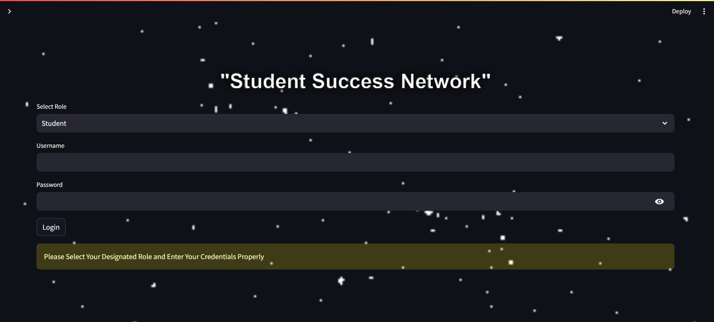

# Student Success Network

Welcome to the Student Success Network, a platform designed to facilitate seamless communication and collaboration between students, advisors, and administrators. Our team has developed this project for the HumanAIze Hackathon, aiming to revolutionize educational technology with innovative AI solutions. The Student Success Network is more than just an educational tool; it's a comprehensive ecosystem designed to enhance the learning experience, making it richer, more engaging, and personalized for every student.

Our mission is to place collaborative learning at the heart of education, utilizing cutting-edge AI to transform how students learn and interact with their mentors and peers. By fostering a supportive and interactive educational environment, we aim to help students unlock their full potential and achieve academic success.

---

## Table of Contents

- [Features](#features)
- [Tech Stack](#tech-stack)
- [Instructions](#instructions)
- [Demo and Website](#demo-and-website)
- [Team Members](#team-members)
- [Contact](#contact)

---

## Features

- **Admin Dashboard**: Oversee portal functionality, upload and process student data, and generate/distribute reports using an ML model for future performance prediction.
  
- **Advisor Portal**: Assign personalized learning tracks and assignments, review submitted assignments, monitor student progress, and facilitate team creation.
  
- **Student Portal**: Access pre-created accounts, check daily tasks and assignments, update progress, and communicate with advisors.

- **Chatbot Assistant**: A special chatbot assistant powered by Anthropic's Claude 3 has been provided for students to assist with queries and provide guidance.

- **Discussion Forum**: A common discussion forum is available for both advisors and students to foster collaboration and share insights.

---

## Tech Stack

- **Frontend**: HTML, CSS, JavaScript
- **Backend**: Python
- **Database**: SQLite
- **Machine Learning**: Scikit-learn
- **Chatbot**: Anthropic's Claude 3
- **Email**: smtplib for email notifications
- **Web Framework**: Streamlit

---

## Instructions

### For Admins:

- **Responsibility**: Oversee the portal's functionality and manage student data.
- **General and Special Reports**: Generate and distribute reports to respective advisors using an ML model for future performance prediction.

### For Advisors:

- **Personalized Learning**: Provide students with tailored learning tracks.
- **Assignments**: Assign regular assignments, review submissions, and offer feedback.
- **Student Monitoring**: Monitor student progress and provide guidance.
- **Team Creation**: Create teams to foster collaboration among students.

### For Students:

- **Login**: Use provided credentials to log in daily.
- **No Account Creation**: Accounts are pre-created; check your email for login details.
- **Assignments**: Complete assignments on time and update progress regularly.
- **Communication**: Engage with advisors for guidance and utilize portal resources for learning.

---

## Demo and Website

- **Demo Video**: [Watch our demo video](https://drive.google.com/file/d/1gPR_R-Tx23l2V95oyK3N4YeENL6A2VXE/view?usp=sharing)
- **Website**: [Visit our website](https://studentsuccessnetwork.streamlit.app/)

*Note: Test out the website using the provided `test_data.csv` file to explore the platform's features and functionalities.*

---

## Team Members

- **Prithvi Ragavendiran R** - IIIrd Year EEE - CIT Chennai
- **Surya Prabhakaran V P** - IIIrd Year CSE - CIT Chennai
- **Koushik N** - IIIrd Year EEE - CIT Chennai
- **Prajen S K** - IIIrd Year EEE - CIT Chennai

---

## Contact

For any queries or issues, please contact us at [jofraarcher04@gmail.com](mailto:jofraarcher04@gmail.com).
